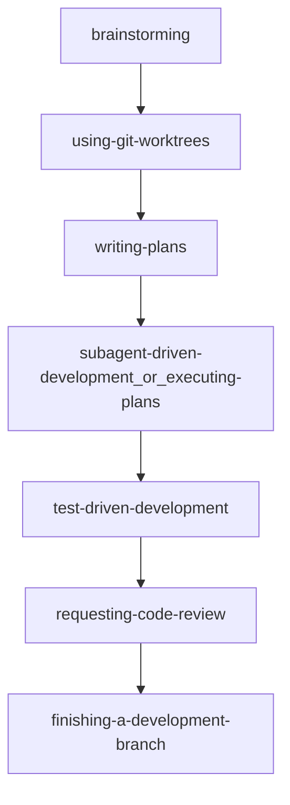

## 概要

[Superpowers](https://github.com/obra/superpowers) は、コーディングエージェント向けのスキル群と開発手法をまとめたフレームワークです。目的は、思いつきで実装を進めるのではなく、仕様化・計画・実装・検証・レビューを一連の流れとして回しやすくすることです。

公式 README では、スキルを文脈に応じて呼び分けることで、設計確認、TDD、レビュー、ブランチ完了までを段階的に進める流れが示されています。

## 背景（解決したい課題）

AI 開発で起きやすい次の課題に対して、手順を標準化して対処するのが Superpowers の狙いです。

- 要件の確認不足のまま実装に入る
- テストを後回しにする
- 実行確認なしで完了と判断する
- 根本原因を追わず場当たりでデバッグする

課題の言語化や実践イメージは、Qiita の解説記事も参考になります。

## 基本ワークフロー

README の「The Basic Workflow」を要約すると次の流れです。

## スキルカテゴリ（代表）

| カテゴリ | 代表スキル | 役割 |
|----------|------------|------|
| Testing | `test-driven-development` | RED-GREEN-REFACTOR を進行に組み込む |
| Debugging | `systematic-debugging` / `verification-before-completion` | 原因調査を段階化し、完了前の検証を徹底する |
| Collaboration | `brainstorming` / `writing-plans` / `subagent-driven-development` など | 設計合意から計画・実装・レビューまでの連携を標準化する |
| Meta | `using-superpowers` / `writing-skills` | フレームワークの使い方やカスタムスキル作成を支援する |

## インストールの要点

プラットフォームごとに導入方法が異なります。最新手順は公式 README を優先してください。

| 環境 | 手順（要点） |
|------|--------------|
| Claude Code（公式 Marketplace） | `/plugin install superpowers@claude-plugins-official` |
| Claude Code（Marketplace 追加経由） | `/plugin marketplace add obra/superpowers-marketplace` の後に `/plugin install superpowers@superpowers-marketplace` |
| Cursor | Agent Chat で `/add-plugin superpowers` |
| Codex | `https://raw.githubusercontent.com/obra/superpowers/refs/heads/main/.codex/INSTALL.md` の手順に従う（クローン + `~/.agents/skills` へシンボリックリンク） |
| OpenCode | `opencode.json` の `plugin` に `superpowers@git+https://github.com/obra/superpowers.git` を追加 |
| Gemini CLI | `gemini extensions install https://github.com/obra/superpowers` |

## このリポジトリとの関係

このリポジトリにある `docs/cursor/agent-skills.md` は、Cursor の Agent Skill の配置や `SKILL.md` の書き方を扱うドキュメントです。一方 Superpowers は、複数プラットフォーム向けに配布されるスキル集合と運用方法論です。  
つまり、**ローカルのプロジェクトスキル運用**と **外部フレームワークとしての Superpowers** は役割が異なり、併用可能です。

## 参考リンク

- [GitHub: obra/superpowers](https://github.com/obra/superpowers)
- [GitHub: superpowers-marketplace](https://github.com/obra/superpowers-marketplace)
- [Superpowers: How I'm using coding agents in October 2025](https://blog.fsck.com/2025/10/09/superpowers/)
- [Superpowers 5](https://blog.fsck.com/2026/03/09/superpowers-5/)
- [Qiita: Superpowers完全ガイド](https://qiita.com/nogataka/items/c2e73515e65533986421)
