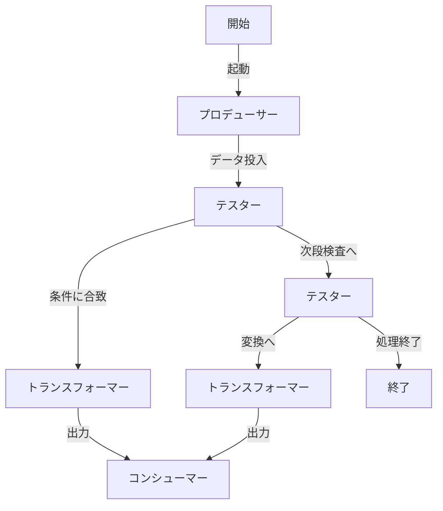
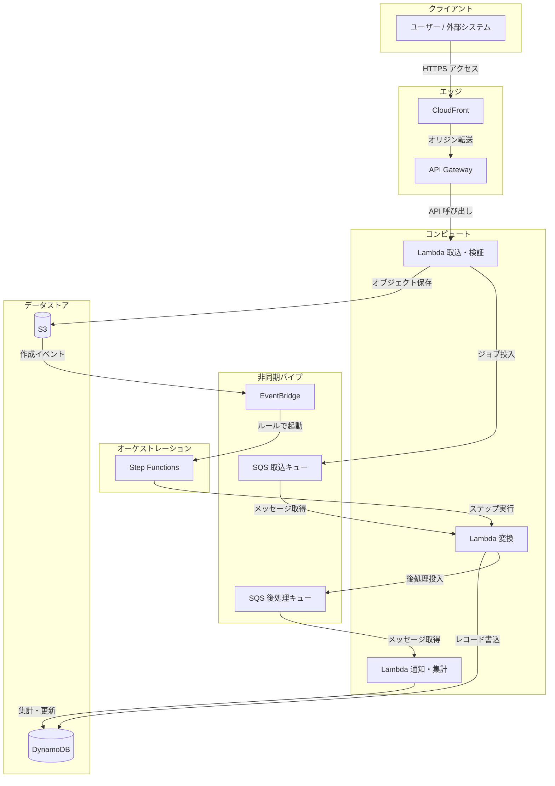

## パイプラインアーキテクチャ

**パイプとフィルタ**（Pipes and Filters）は、データを段階的に流しながら変換・検査する構成の考え方。Unix シェルで `command1 | command2` のように **標準出力を次の標準入力へつなぐ** のが典型で、サービスや分散処理でも同じ発想で分解できる。

### Shell におけるイメージ

- 各プロセスは **フィルタ** として振る舞い、**パイプ `|`** は隣のプロセスへバイト列（ストリーム）を渡す導管。
- 左から右へ **一方向** にデータが流れ、各段はできるだけ **単一責任**（1種類の変換や検査）に寄せると扱いやすい。

### トポロジー

**ポイント・ツー・ポイント（P2P）** とは、ここではネットワークの P2P ではなく、**処理ブロック同士が隣接して1対1で繋がる** 形のこと（分岐・合流があっても、接続そのものは点と点の関係）。中央にすべてを集めるハブ型ではなく、**上流 → 下流** の鎖として表現する。

### フィルタ

**自己完結型**の処理単位。入出力の契約が決まっていれば、単体でテスト・差し替え・再利用しやすい。

| 種類 | 役割 |
|------|------|
| **プロデューサー** | データの起点。入力がなく（または主に）出力するソース。 |
| **トランスフォーマー** | 入力を受け、変換して出力する。関数型の **map** に相当するイメージ。 |
| **テスター** | 入力を検査し、結果に応じて次の接続先や通過可否を決める（分岐・ゲート）。**reduce** と書く資料もあるが、配列の `reduce` そのものというより **判定に基づく絞り込み・振り分け** のニュアンス。 |
| **コンシューマー** | 終点。永続化、外部 API への送出、UI への反映など、流れを「確定」させる。 |

### パイプ

**非自己完結**。フィルタ同士をつなぐだけの成分で、**データの意味を変えない**（転送・バッファ・流量調整など）。パイプ単体には業務上の処理がない。

### アーキテクチャ例（概念図）

分岐（テスターから複数経路）と合流（複数トランスフォーマーから同一コンシューマー）のイメージ。



## 実装例

### サービスにおける例

- **CI/CD**：GitHub Actions / GitLab CI / Jenkins — ステージを直列（または分岐）でつなぎ、成果物・環境を次段へ渡す。
- **ストリーム処理**：Kafka Streams / Flink / Kinesis — map / filter / aggregate の演算子チェーン。
- **オーケストレーション**：AWS Step Functions / EventBridge Pipes — ステップ間でペイロードを受け渡し。
- **ETL/ELT**：Airflow / dbt / Dataflow — 抽出→変換→ロードをタスク DAG で表現（グラフ寄りだが思想は同じ）。

### AWS システム構成例（Mermaid）

**想定している業務イメージ**

利用者（顧客・店舗・社内担当・外部システム）が、画面や API から **書類・証憑・添付ファイル・インポート用データ** を渡す。受付の時点では **その場で結果を返しきれない** 仕事があり（フォーマット検査、マスキング、他部門システムへの連携、承認プロセスへの載せ、など）、まず **原本を確実に預かる** と同時に **あとから順番に処理するためのきっかけ** を渡す。バックグラウンドでは **内容の変換・照合・台帳への反映** が進み、必要に応じて **関係者への通知** や **集計・ステータスの更新** までつながる。図では「受付 → 保管とキュー → 変換 → 記録 → 通知・締め」という **業務上の段階** を、イベントとキューでつないでいる。

以下はその流れを AWS 上で表した例（プロデューサー → キュー／イベント → トランスフォーム → 永続化の技術イメージ）。



**S3 の「オブジェクト保存」と SQS の「ジョブ投入」**：この図では **どちらか一方（排他）ではなく、併用するイメージ**が一般的。例として、大きなファイルや原本は S3 に置き、非同期処理用にメタデータや S3 キーを載せたメッセージを SQS に送る。要件によっては **SQS のみ**（小さなペイロードだけをキューで運ぶ）、**S3 のみ**（アップロード後は S3→EventBridge だけで後続を起動し、L1 からは SQS に投げない）といった **いずれか一方に寄せる**構成もある。

補足：実際の構成は要件で **ALB + ECS/Fargate** に置き換えたり、**Kinesis / MSK** でストリーム化したり、**EventBridge Pipes** で SQS から直接ターゲットへつなぐなどバリエーションがある。

### Node.js / TypeScript における技術要素

| 役割 | 技術・API（Node.js 標準） | 補足 |
|------|---------------------------|------|
| パイプ | `stream`（`Readable` / `Transform` / `Writable` / `pipeline`） | バックプレッシャ・エラー伝播を `pipeline()` で統一しやすい |
| パイプ | `async` / `await` + 配列やジェネレータで段階関数を呼ぶ | 小規模データ・同期寄りのチェーン向け |
| トランスフォーマ | `Transform` ストリーム、`map` 的な中間処理 | チャンク単位の変換 |
| テスター | `PassThrough` + 条件分岐、`filter` 相当の `Transform` | 通過/破棄/別ストリームへ振り分け |
| コンシューマ | `Writable`、`for await` で最後まで消費 | DB 書き込み、ログ、レスポンス送信 |
| HTTP 上のパイプライン | ミドルウェアの列（リクエストが順に通る） | 認証・バリデーション・ロギングがフィルタに相当 |

### パッケージ要素（例）

| カテゴリ | パッケージ | 用途 |
|----------|------------|------|
| Web フレームワーク | `express`, `fastify`, `hono` | ミドルウェアチェーン、`preHandler` / `onRequest` など段階処理 |
| バリデーション（テスター） | `zod`, `valibot`, `ajv` | 入力検査→型付きオブジェクトへ（トランスフォームとセットで使うことも多い） |
| ストリーム行分割 | `split2` | `createReadStream` のチャンクを行に分割し、下流のテスター／トランスフォームへ |
| 関数型パイプライン | `rxjs`（`pipe`, `map`, `filter`） | イベント・非同期ストリームを演算子でつなぐ |
| ユーティリティ | `lodash` / `remeda`（`pipe`, `flow`） | 同期データの段階変換（メモリ上の配列・オブジェクト向け） |
| ログ | `pino`, `winston` | 構造化ログを次段（転送・集約）へ渡す前提の「シンク」 |
| HTTP クライアント | `undici`, `axios` | プロデューサー側で外部取得→後段へ body を渡す |
| ジョブ / キュー | `bullmq`, `graphile-worker` | ワーカーがタスクを取り出し、複数ステップをキューで直列化 |

### コードイメージ（ストリーム + pipeline）

```typescript
import { createReadStream, createWriteStream } from "node:fs";
import { pipeline } from "node:stream/promises";
import { Transform } from "node:stream";

// テスター相当: 条件を満たすチャンクだけ通す（行単位なら split2 等で分割してから繋ぐ）
const onlyOk = new Transform({
  transform(chunk: Buffer, _enc, cb) {
    if (chunk.toString().includes("OK")) this.push(chunk);
    cb();
  },
});

// トランスフォーマー相当
const upper = new Transform({
  transform(chunk, _enc, cb) {
    cb(null, chunk.toString().toUpperCase());
  },
});

await pipeline(createReadStream("in.txt"), onlyOk, upper, createWriteStream("out.txt"));
```

### コードイメージ（Express のミドルウェア列）

```typescript
import express from "express";

const app = express();
app.use(express.json()); // パース
app.use((req, res, next) => {
  if (!req.headers.authorization) return res.status(401).end(); // テスター
  next();
});
app.post("/api", (req, res) => {
  res.json({ ok: true }); // コンシューマー
});
```
