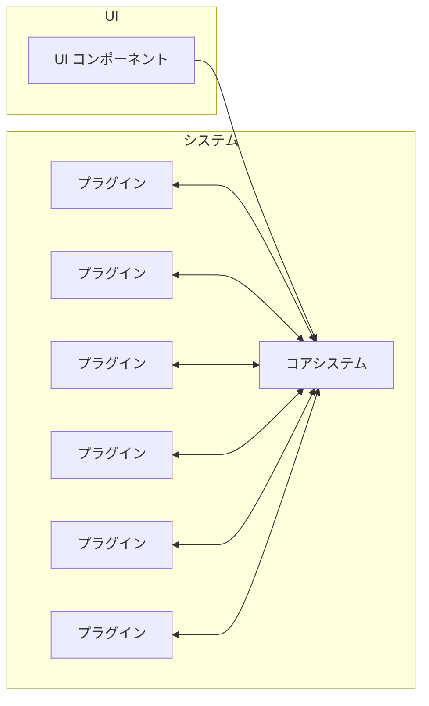

## 概要

**マイクロカーネルアーキテクチャ**（Microkernel Architecture）は、システムを **最小限の「核」** と **差し替え可能な拡張** に分ける考え方である。核は安定した実行基盤に留め、多様な要件はプラグイン側に寄せることで、**循環的複雑度を抑え**、**拡張性と保守性** を高めやすい。

身近な例として、**Eclipse** や **Visual Studio Code** のような IDE は、編集・ワークスペースなどの共通基盤をコアにし、言語支援やテーマなどを拡張（プラグイン）として載せる構成に近い。

## コアシステム

システムを動かすのに **必要最低限の機能だけ** を持つ部分。業務や製品ごとの特殊ロジックはここに詰め込まず、**プラグインと組み合わせて** 全体像を作る。

| 観点 | 内容 |
|------|------|
| 役割 | 実行・ライフサイクル・共通サービスなど、**どの構成でも共通になる土台** |
| 例 | 電子機器の検査アプリで、査定ルールごとの処理はプラグインに任せ、**ルールの読み込みや実行の枠組み** だけをコアに置く |
| 狙い | コアを小さく保ち、変更の波及をプラグイン側に閉じやすくする |

コアは **プラグインコンポーネントを束ねる器** であり、拡張そのものの実装詳細はプラグイン側に寄せる。

## プラグインコンポーネント

コアを **強化・拡張する** ための追加機能やカスタム処理を担うコンポーネント。

- **コアの一部ではない**。コアに「追加する」関係であり、境界を明示できる。
- **互いに独立**し、**依存関係がない** のが理想。プラグイン同士が密結合すると、差し替えや単体検証が難しくなる。

UI を別レイヤとして置く場合、ユーザー操作は **UI → コア** を経由し、実際の拡張処理は **プラグイン ↔ コア** の契約に沿って動く、という整理がしやすい。

### 構成のイメージ

## 実現方式

プラグインをどう **配備・読み込み** するかの代表的なパターン。

| 方式 | 要点 |
|------|------|
| **共有ライブラリ** | OS の共有ライブラリや DLL などとして配布し、ランタイムに読み込む |
| **パッケージ／名前空間** | 言語やモジュールシステムのパッケージ・名前空間でプラグインを区切る |
| **REST などのリモート** | プロセスやホストをまたぎ、**ネットワーク越し** にプラグイン能力を利用する |

方式の選択は、**デプロイのしやすさ**、**隔離の強さ**、**レイテンシ**、**運用コスト** のトレードオフになる。

## プラグインレジストリ

コアは **利用可能なプラグインの一覧** を把握する必要がある。それを **プラグインレジストリ** に集約する実装がよく用いられる。

- 各プラグインはレジストリに **登録** される。
- コアは起動時や必要に応じてレジストリを **参照** し、該当プラグインを **読み込み・有効化** する。

「どのプラグインが存在し、どの版が有効か」を一箇所で管理できると、**探索・競合・有効／無効の制御** がしやすい。

## コントラクト（契約）

コアとプラグインの間の **通信・連携の約束事**。ここが曖昧だと、バージョンアップのたびに両方が壊れやすくなる。

含めるとよい要素の例:

- **動作**（いつ呼ばれるか、ライフサイクル）
- **入力データ** の形と意味
- **出力データ** の形と意味
- エラー時の扱い（リトライ可否、フォールバックなど）

**XML や JSON** などの **構造化データ** でコントラクトを定義すると、スキーマ検証やドキュメント生成と相性がよい。

---

*出典メモ: 『ソフトウェアアーキテクチャの基礎』第12章*
