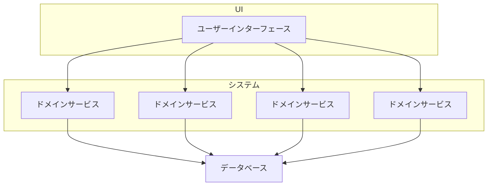
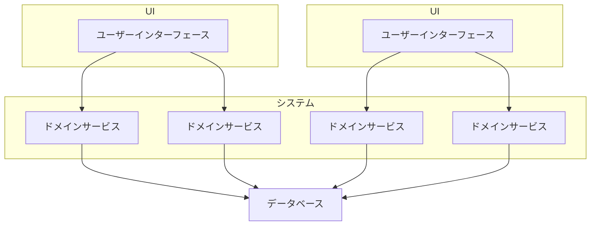
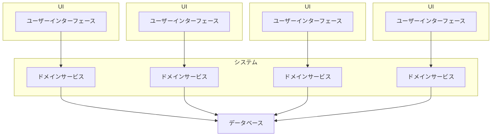
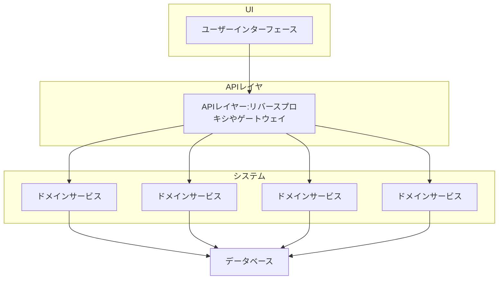
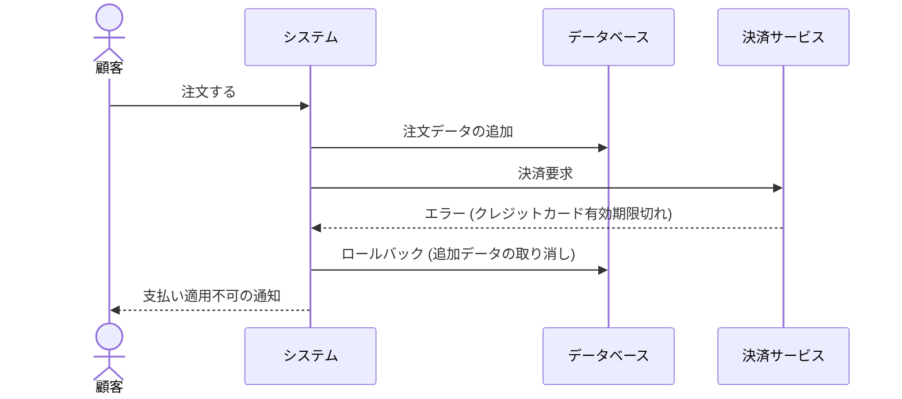
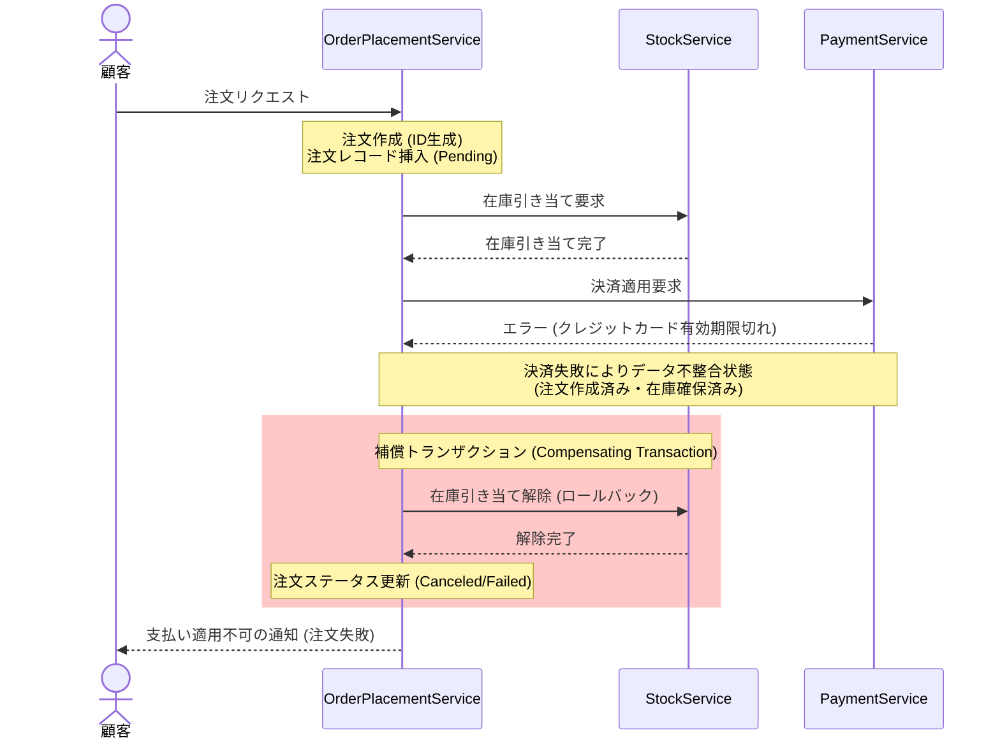
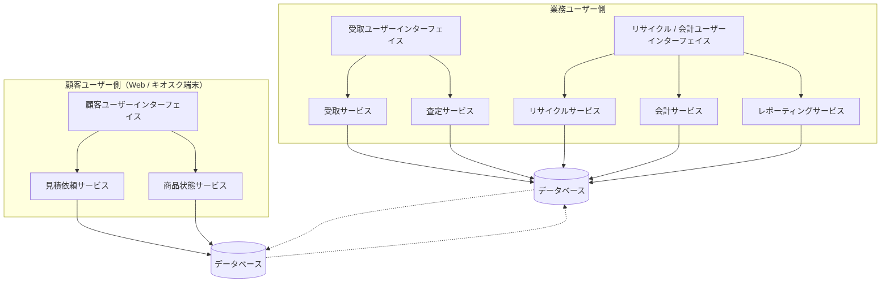

## 概要

**サービスベースアーキテクチャ**は、マイクロサービスアーキテクチャのハイブリッド版とも言えるアーキテクチャスタイルです。

## トポロジー

### 構成要素

- **個別にデプロイされたユーザーインターフェース**
- **個別にデプロイされた粒度の粗いリモートサービス**（ドメインサービスと呼ばれる）
- **モノリシックなデータベース**

### ユーザーインターフェースからサービスへのアクセス方法

- REST
- メッセージング
- リモートプロシージャコール（RPC）
- SOAP

殆どの場合はユーザーインターフェースやAPIゲートウェイ、サービスロケーターパターンを使って、ユーザーインターフェースはサービスに直接アクセスします。

### 重要な側面

- **一般に中央でデータベースを共有する**
  - **メリット**: SQLクエリや結合を活用できる（レイヤードアーキテクチャと同様）
  - **デメリット**: データベースの変更が問題になる
- **ドメインサービス間の通信は避ける**

### トポロジーの種類

#### 単一のモノリシックユーザーインターフェース

#### ドメインベースのユーザーインターフェース

#### サービスベースのユーザーインターフェース

#### 横断的な関心事の考慮

## サービス設計と粒度

サービスベースアーキテクチャのドメインサービスは一般的に**粗い粒度**を持ちます。ドメインサービスはUIからの何らかのビジネス機能を提供します。
単一のドメインサービス内でのDB整合性を確保するのに**ACIDトランザクション**が使用されます。

一方、マイクロサービスなどの分散アーキテクチャはサービスの粒度が細かく、**BASEトランザクション**と呼ばれる分散トランザクション技術が使用されます。

### 事例: クレジットカード決済の失敗

顧客が注文した際に、支払いに使用したクレジットカードの有効期限が切れていた場合を想定します。

#### ACIDトランザクションの場合

- **A**tomicity: 原子性
- **C**onsistency: 一貫性
- **I**solation: 隔離性
- **D**urability: 永続性

#### BASEトランザクションの場合

- **B**asic **A**vailability: 基本的な可用性
- **S**oft state: 軟状態
- **E**ventual consistency: 最終一貫性

## サービスベースアーキテクチャの例

### 電子機器リサイクルシステム

## メモ: サービスロケーターパターンとは

**サービスロケーターパターン（Service Locator Pattern）**とは、ソフトウェア設計におけるデザインパターンの1つで、アプリケーションが必要とするサービス（依存するオブジェクトやコンポーネント）を、中央の「ロケーター（Locator）」と呼ばれるオブジェクトを通じて取得する仕組みのことです。

簡単に言うと、**「必要な部品（サービス）がどこにあるかを知っている案内所（ロケーター）を用意し、各クラスはそこから部品をもらってくる」**という設計です。

システムアーキテクチャ（特にマイクロサービスや分散システム、SOAなど）の文脈における「サービスロケーターパターン」は、一般的に**「サービスディスカバリ（Service Discovery）」**や**「サービスレジストリ（Service Registry）」**という仕組みとして語られます。

プログラム設計（オブジェクト指向）の文脈では「メモリ上のインスタンス（クラス）」を探す役割でしたが、アーキテクチャの文脈では**「ネットワーク上の別のシステム（IPアドレスやポート番号）」を探す役割**にスケールアップします。

### 解決したい課題

クラウド環境やコンテナ環境（Kubernetesなど）では、サーバー（サービス）のインスタンスが動的に増減（オートスケール）したり、障害で再起動したりするため、**IPアドレスやポート番号が頻繁に変わります**。
そのため、システムAがシステムBを呼び出す際に、システムBのIPアドレスをシステムAの設定ファイルに直接ハードコード（固定書き）してしまうと、システムBのIPが変わった瞬間に通信できなくなってしまいます。

### アーキテクチャにおける仕組み

この問題を解決するために、システム全体の「電話帳（案内所）」となる**サービスレジストリ（これがロケーターにあたります）**を配置します。

1. **登録（Register）**:
   各サービス（例：決済サービス、ユーザーサービス）は、起動時に自分の「サービス名」と「現在のIPアドレス・ポート番号」をサービスレジストリに登録します。
2. **照会（Lookup / Discover）**:
   システムAが決済サービスを呼び出したい場合、まずサービスレジストリに対して「決済サービスはどこにありますか？」と問い合わせます。
3. **ルーティング**:
   サービスレジストリから最新のIPアドレスを教えてもらい、システムAはそのアドレス宛てに通信を行います。

### 主な実装パターン

アーキテクチャ上でのサービスロケーター（ディスカバリ）には、大きく2つのアプローチがあります。

#### 1. クライアントサイド・ディスカバリ

呼び出し元のシステム（クライアント）自身が、直接サービスレジストリに問い合わせに行き、取得した複数のIPアドレスの中から自分でロードバランシング（負荷分散）して通信先のインスタンスを決定する方式です。

* **代表例**: Netflix Eureka, HashiCorp Consul などを組み込んだアプリケーション

#### 2. サーバーサイド・ディスカバリ

呼び出し元のシステムは、ロードバランサー（またはAPIゲートウェイ）という中継地点にリクエストを投げます。このロードバランサーが裏側でサービスレジストリに問い合わせを行い、適切な宛先へリクエストを転送する方式です。クライアントはロケーターの存在を意識する必要がありません。

* **代表例**: KubernetesのService（Kube-proxyとCoreDNSの仕組み）、AWSのALB（Application Load Balancer）など

### アーキテクチャにおけるメリット・デメリット

**メリット**
* **動的なスケーリングへの対応**: サーバーが増減しても、IPアドレスの変更にシステムが自動で追従できます。
* **疎結合**: 呼び出し元は「相手の物理的な場所（IP）」を知る必要がなく、「相手の名前（サービス名）」だけを知っていればよくなります。

**デメリット**
* **単一障害点（SPOF）のリスク**: 案内所であるサービスレジストリ自体がダウンすると、システム全体が通信先を見失い、連鎖的な障害に繋がります（そのため、レジストリ自体を高度に冗長化する必要があります）。
* **ネットワークのオーバーヘッド**: 通信する前に「場所を聞く」というステップが入るため、わずかにネットワークの遅延（レイテンシ）が増加します。

---

**まとめ**

アーキテクチャの文脈では、サービスロケーターパターンは**「動的に変化するネットワーク環境で、システム同士が迷子にならずに通信するための電話帳（サービスディスカバリ）」**として、現代のクラウドネイティブなシステムにおいて非常に重要な（そして標準的な）役割を担っています。プログラミングレベルではアンチパターンとされることが多いですが、インフラ・アーキテクチャレベルでは必須のパターンと言えます。
